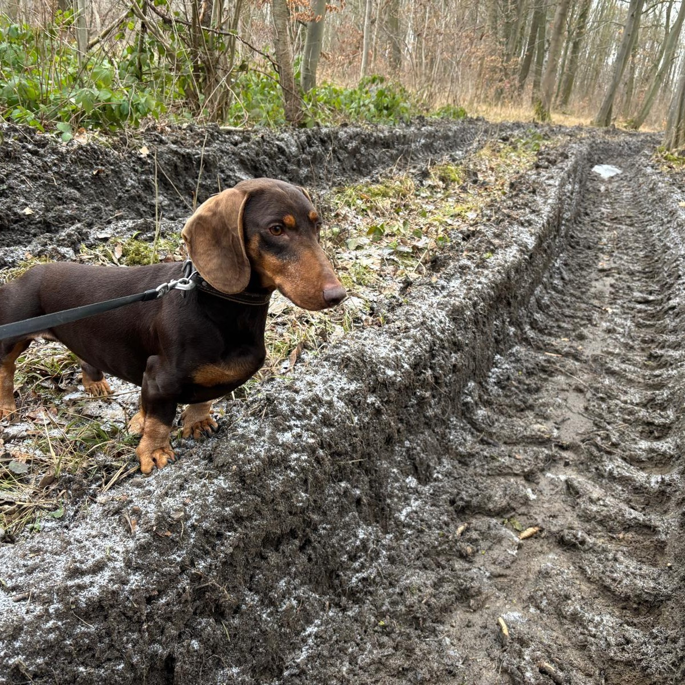
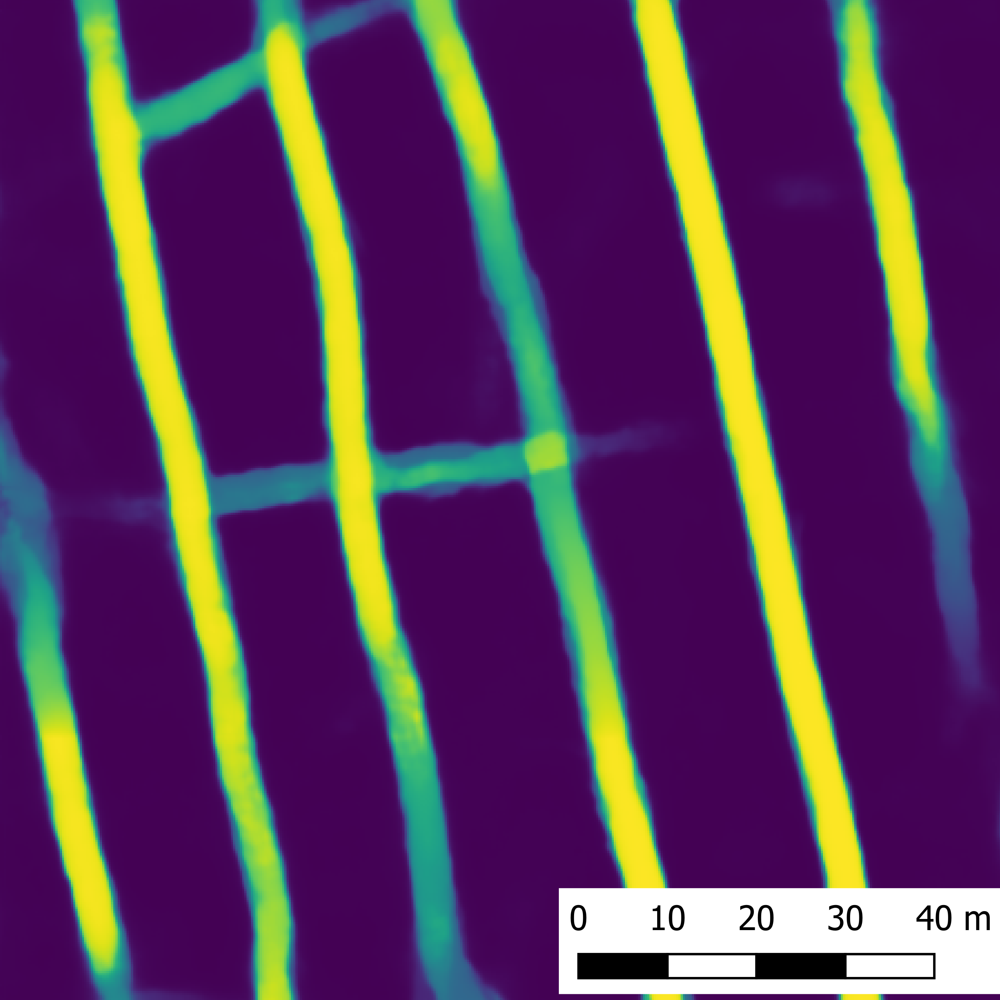
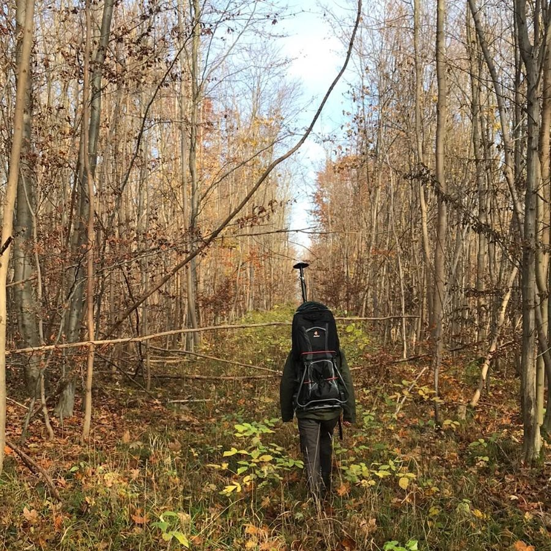
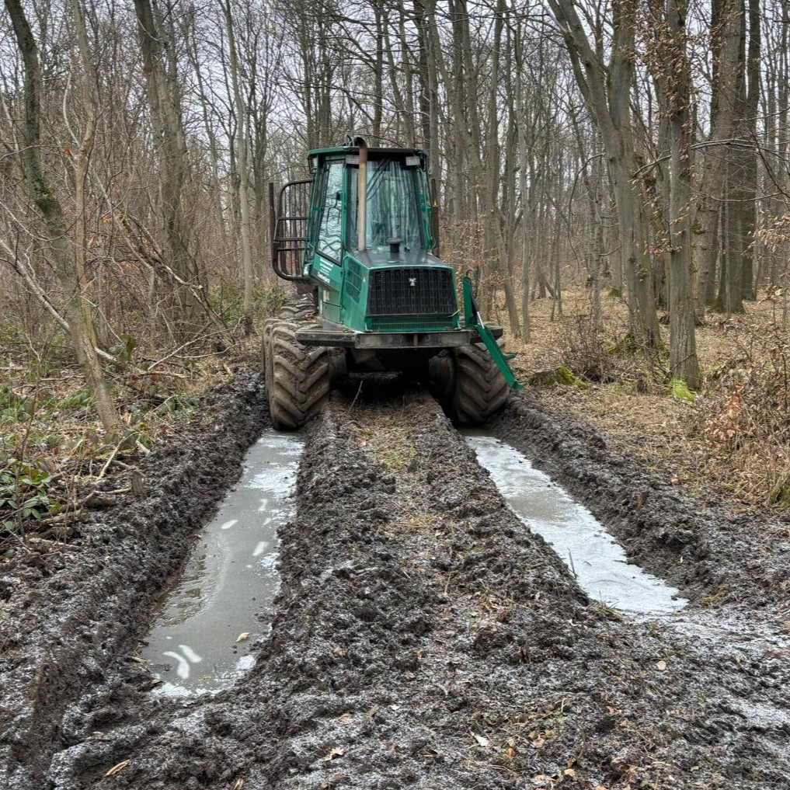

   
  
  

  <em>
    TrailScan is a 
    <a href="https://www.hawk.de/de/forschung/forschungsprojekte/trailscan" target="_blank">
      HAWK Research Project
    </a>
    funded by 
    <a href="https://sattelmuehle-stiftung.org/" target="_blank">
      Sattelmuehle Foundation
    </a>
  </em>

**TrailScan** is QGIS Plugin designed to apply a deep learning model to **detect and segment skid trails (logging trails)** from Airborne Laser Scanning (ALS) data. In Central European mixed and deciduous forests, permanently designed skid trail networks are used by ground-based forest operations, e.g. harvesters, forwarders and other heavy vehicles. 

---

   
   
   
   

---

# Input Data Requirements
ALS data can be collected using aircraft, helicopters, or UAVs equipped with LiDAR sensors. To ensure compatibility with TrailScan, we recommend the following:
- **Format**: LAS or LAZ format with a valid georeference
- **Point Classification**: Follow the standard LAS/LAZ classification scheme.
    - Ground points (class 2) are required for preprocessing.
    - If ground classification is missing, it can be generated using PDAL or equivalent tools.
- **Point Density**: 
    - Minimum: 6 points/m²
    - Recommended maximum: 20 points/m² (ensures reliable DTM, CHM, LRM, and VDI derivation)

**Tested ALS Data Sources (Germany)**

| Region                   | Data Portal                                                                                                 | Notes                                                                           |
| ------------------------ | ----------------------------------------------------------------------------------------------------------- | ------------------------------------------------------------------------------- |
| **Bavaria**              | [Geoportal Bayern](https://geodaten.bayern.de/opengeodata/OpenDataDetail.html?pn=laserdaten)                | Direct LAS/LAZ downloads available                                              |
| **Thuringia**            | [Geoportal Thüringen](https://geoportal.thueringen.de/gdi-th/download-offene-geodaten/download-hoehendaten) | Direct LAS/LAZ downloads available                                                |
| **Saxony**               | [Geoportal Sachsen](https://www.geodaten.sachsen.de/downloadbereich-digitale-hoehenmodelle-4851.html)       | Direct LAS/LAZ downloads available                                                  |
| **Brandenburg**          | [GeoBasis Brandenburg](https://data.geobasis-bb.de/geobasis/daten/als/)                                     | Direct LAS/LAZ downloads available                                                           |
| **Rhineland-Palatinate** | [GeoShop RLP](https://lvermgeo.rlp.de/geodaten-geoshop/open-data)                                           | Point clouds split into **terrain (lpg)** and **objects (lpo)** - merge in QGIS |

---

## Workflow - Instructions

## 1. TrailScan Preprocessing

- **Input:** ALS point clouds in `.laz` or `.las` format are opened directly in QGIS.  
- The preprocessing tool converts the point cloud into a **4-band georeferenced raster image**:
  - **Band 1:** Digital Terrain Model (DTM)  
  - **Band 2:** Canopy Height Model (CHM)  
  - **Band 3:** Micro-Relief Model (MRM)  
  - **Band 4:** Vegetation Density Index (VDI)  
- All raster values are **normalized to a range between 0 and 1**, which is why the output is named the *Normalized File*.  

## 2. TrailScan Inference

- **Input:** the *Normalized File* generated in step 1.  
- Download the TrailScan model here and save it on your local computer: 
  

  <em>
    <a href="https://doi.org/10.25625/GEIP6T">
      TrailScan Model "Thuringia" (incl. test data)
    </a>
  </em>

- Add the path to the TrailScan Model file saved on your computer. 
- The TrailScan model processes the *Normalized File* and produces a **Trailmap**.  

**Trailmap** is a prediction raster with values between 0 and 1:  
- `0` = no skid trail  
- `>0` = probability of a skid trail (the higher the value, the more likely a trail is present).  

---

# Requirements

# QGIS Installation
**Quick Start (Windows Users)**

- Install QGIS via the **OSGeo4W Network Installer**, e.g. via https://qgis.org/download 
- Choose "Quick Installation" – this should automatically include Python and PDAL
- If you want to check the PDAL version used by QGIS, you might open the OSGeo4W Shell (from the Start Menu) and run:

  `pdal --version`

**Notes**
- Do not use the standard Windows Command Prompt or PowerShell for PDAL checks unless you installed PDAL system-wide.
- On Linux, you may simply use:

  `pdal --version`

- Currently we do **NOT** recommend the use of TrailScan on MacOS, see [Issue #15](https://github.com/GISLAB-HAWK/TrailScan-QGIS-Plugin/issues/15)

# Plugin Installation
**In QGIS, navigate to 'Plugins' -->  'Manage and Install Plugins...'**
**Important Note**
- Experimental version: You may need to activate "Show experimental Plugins" in the "Settings" section of QGIS Plugins menu!

- Search for 'TrailScan' and click on 'Install Plugin'
- -Aditional Python packages are installed automatically with the plugin installation:
  - `numpy`
  - `scipy`
  - `laspy`
  - `lazrs`
  - `rasterio`
  - `onnxruntime`

> **Important:** You may need to restart QGIS after TrailScan Plugin installation.

---
## Hardware Recommendations: 

- CPU: Multi-core processor (Intel i7/i9 or AMD Ryzen recommended). 
- RAM: Minimum 16 GB (32 GB or more recommended for large point clouds).  
- GPU: Not required, but ONNX Runtime can optionally leverage GPU acceleration if supported drivers are installed.

---
## Publications: 

  <em>
    <a href="https://www.researchgate.net/publication/378395450_Automatisierte_Kartierung_forstlicher_Feinerschliessung" target="_blank">
      Kempen T, Freudenberg M, Fuchs H, Magdon P (2024) Automatisierte Kartierung forstlicher Feinerschließung. AFZ DerWald, 3, 12–15.
    </a>
  </em>

  <em>
    <a href="https://publikationsserver.hawk.de/receive/hawk_mods_00000314  " target="_blank">
      Kempen T.  (2025) Kartierung von Rückegassen aus flugzeugbasierten Laserscan-Daten durch ein CNN. Masterarbeit, Universität Göttingen.
    </a>
  </em>

