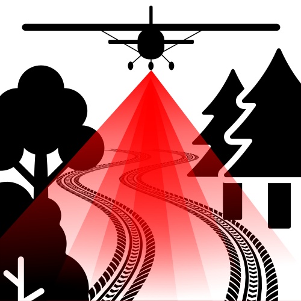

       
       
  

**TrailScan** is a deep learning model designed to automatically **detect and segment skid trails (logging trails)** from Airborne Laser Scanning (ALS) data in Central European mixed and deciduous forests.
---
# Input Data Requirements
ALS data can be collected using aircraft, helicopters, or UAVs equipped with LiDAR sensors. To ensure compatibility with TrailScan, we recommend the following:
- **Format**: LAS or LAZ format with a valid georeference
- **Point Classification**: Follow the standard LAS/LAZ classification scheme.
    - Ground points (class 2) are required for preprocessing.
    - If ground classification is missing, it can be generated using PDAL or equivalent tools.
- **Point Density**: 
    - Minimum: 6 points/m²
    - Recommended maximum: 20 points/m² (ensures reliable DTM, CHM, LRM, and VDI derivation)

**Tested ALS Data Sources (Germany)**

| Region                   | Data Portal                                                                                                 | Notes                                                                           |
| ------------------------ | ----------------------------------------------------------------------------------------------------------- | ------------------------------------------------------------------------------- |
| **Bavaria**              | [Geoportal Bayern](https://geodaten.bayern.de/opengeodata/OpenDataDetail.html?pn=laserdaten)                | Direct LAS/LAZ downloads available                                              |
| **Thuringia**            | [Geoportal Thüringen](https://geoportal.thueringen.de/gdi-th/download-offene-geodaten/download-hoehendaten) | Direct LAS/LAZ downloads available                                                |
| **Saxony**               | [Geoportal Sachsen](https://www.geodaten.sachsen.de/downloadbereich-digitale-hoehenmodelle-4851.html)       | Direct LAS/LAZ downloads available                                                  |
| **Brandenburg**          | [GeoBasis Brandenburg](https://data.geobasis-bb.de/geobasis/daten/als/)                                     | Direct LAS/LAZ downloads available                                                           |
| **Rhineland-Palatinate** | [GeoShop RLP](https://lvermgeo.rlp.de/geodaten-geoshop/open-data)                                           | Point clouds split into **terrain (lpg)** and **objects (lpo)** — merge in QGIS |

---

## Workflow - Instructions

## 1. TrailScan Preprocessing

- **Input:** ALS point clouds in `.laz` or `.las` format are opened directly in QGIS.  
- The preprocessing tool converts the point cloud into a **4-band georeferenced raster image**:
  - **Band 1:** Digital Terrain Model (DTM)  
  - **Band 2:** Canopy Height Model (CHM)  
  - **Band 3:** Micro-Relief Model (MRM)  
  - **Band 4:** Vegetation Density Index (VDI)  
- All raster values are **normalized to a range between 0 and 1**, which is why the output is named the *Normalized File*.  

## 2. TrailScan Inference

- **Input:** the *Normalized File* generated in step 1.  
- Add the path to the `trailscan_model.onnx` file.  
- The TrailScan model processes the *Normalized File* and produces a **Trailmap**.  

**Trailmap** is a prediction raster with values between 0 and 1:  
- `0` = no skid trail  
- `>0` = probability of a skid trail (the higher the value, the more likely a trail is present).  

---

# Requirements

# QGIS Installation
**Quick Start (Windows Users)**

- Install QGIS via the **OSGeo4W Network Installer**, e.g. via https://qgis.org/download 
- Choose "Quick Installation" – this should automatically include Python and PDAL
- If you want to check the PDAL version used by QGIS, you might open the OSGeo4W Shell (from the Start Menu) and run:

  `pdal --version`

**Notes**
- Do not use the standard Windows Command Prompt or PowerShell for PDAL checks unless you installed PDAL system-wide.
- On Linux and macOS, you can simply use:

  `pdal --version`

  > **Tip:** Depending on your macOS setup, you may need a dedicated Python environment (e.g., via conda or venv) to ensure compatibility with QGIS. 

**Additional Python packages are installed automatically with the plugin installation:**
  - `numpy`
  - `scipy`
  - `laspy`
  - `lazrs`
  - `rasterio`
  - `onnxruntime`
---
## Hardware Recommendations: 

- CPU: Multi-core processor (Intel i7/i9 or AMD Ryzen recommended). 
- RAM: Minimum 16 GB (32 GB or more recommended for large point clouds).  
- GPU: Not required, but ONNX Runtime can optionally leverage GPU acceleration if supported drivers are installed.
